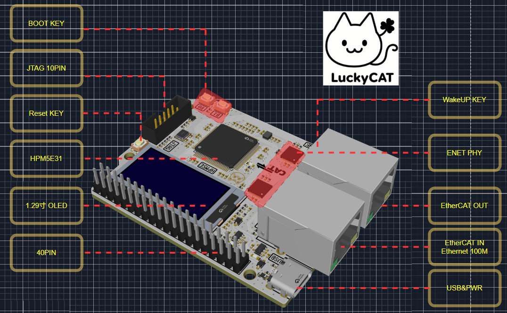
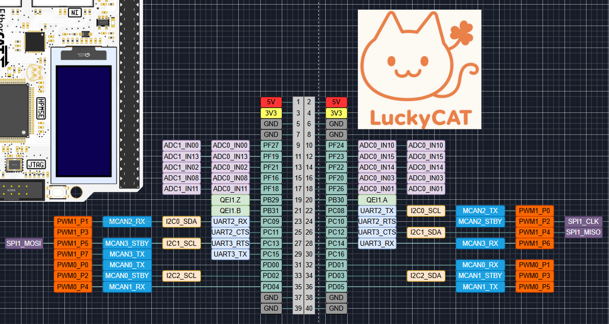
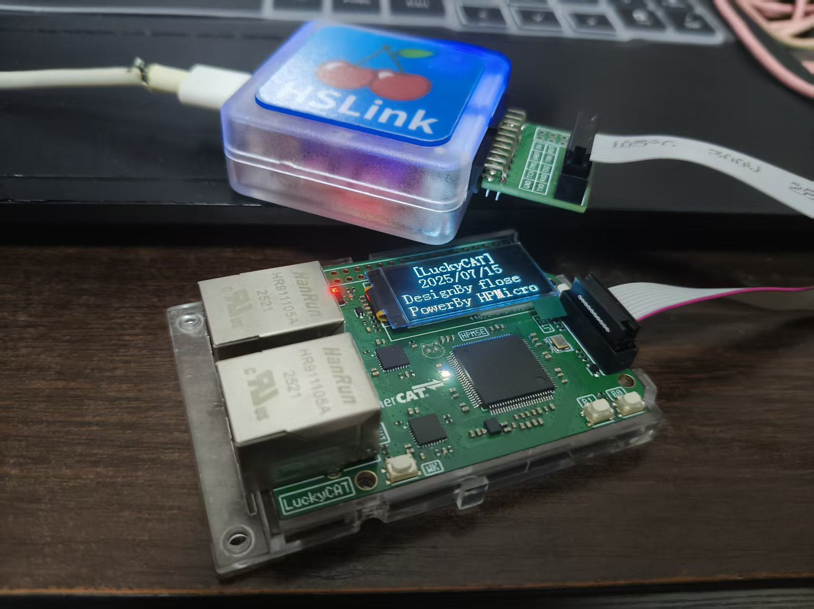
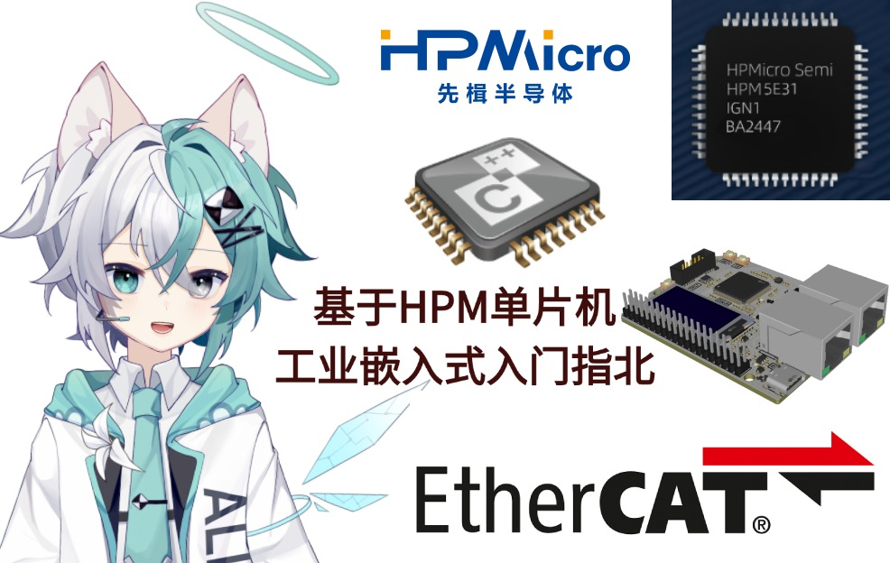

  

## 📒 简介

🌟LuckyCAT是一款采用先辑半导体 HPM5E31 芯片，支持EtherCAT主从站开发的工业嵌入式开发板，适用于刀片IO、PLC、伺服电机等工业嵌入式应用，主频高达480MHz，能满足复杂的逻辑设计需求，采用全国产化设计，原理图PCB全开源，提供入门资料和视频方便新手快速上手开发。

[📺 LuckyCAT入门视频教程](https://www.bilibili.com/video/BV1TauAzhEUK/?share_source=copy_web&vd_source=4ee7262585fd8c76ac279a555c7b3054) | [💻 例程源码仓库](https://github.com/coinlockerbaby/LuckyCAT_SoftWare) | [🐧 QQ交流群](https://qm.qq.com/q/nPpUbjPaXm) (群号：195646621)    

## 特性

* 480MHz主频 Andes RISC-V CPU

* 32KB 高速缓存 (I/D Cache) 和共计高达 256KB 的零等待指令加数据本地存储器 (ILM / DLM)，256KB 通用 SRAM

* EtherCAT从站控制器(2端口)

* 100Mbps以太网

* 内置 1 MB Flash 闪存

* 1.29寸 OLED单色屏

## 🔨 硬件介绍

### 硬件框架图

### 引脚pinout

## 实物展示

## 💻软件例程

[💻 例程源码仓库](https://github.com/coinlockerbaby/LuckyCAT_SoftWare)

| 例程名           | 运行现象                             | 相关外设 |
| ------------- | -------------------------------- | ---- |
| 1_led_blink   | 运行工程，板载LED将进行闪烁                  | GPIO |
| 2_key         | 运行工程，按下B0按钮板载LED亮起，按下B1按钮板载LED灭掉 | GPIO |
| 3_oled_sw_i2c | 运行工程，屏幕开始显示                      | GPIO |
|               |                                  |      |

## 📺入门视频

[📺 LuckyCAT入门视频教程](https://www.bilibili.com/video/BV1TauAzhEUK/?share_source=copy_web&vd_source=4ee7262585fd8c76ac279a555c7b3054)

| 视频名           | 上传时间                | 链接                                                                                                                             |
| ------------- | ------------------- | ------------------------------------------------------------------------------------------------------------------------------ |
| 开发环境搭建        | 2025-07-14 01:48:43 | [开发环境搭建](https://www.bilibili.com/video/BV1TauAzhEUK/?share_source=copy_web&vd_source=4ee7262585fd8c76ac279a555c7b3054)        |
| 调试器的使用以及ISP下载 | 2025-07-14 15:43:20 | [调试器的使用以及ISP下载](https://www.bilibili.com/video/BV1WBuvz2ENZ/?share_source=copy_web&vd_source=4ee7262585fd8c76ac279a555c7b3054) |
|               |                     |                                                                                                                                |

## 📑拓展板计划

> 注：若需要支持拓展板，LuckyCAT的40PIN引脚请不要使用排针，而是使用Arduino Shield同款的加长排母

| 拓展板名       | 功能(计划)             | 开源链接 |
| ---------- | ------------------ | ---- |
| PLC_Shield | 数字IO+模拟IO+RS485    |      |
| FOC_Shield | 带一个PMSM/BLDC+FDCAN |      |
| DCU_Shield | 4xFDCAN            |      |
|            |                    |      |
